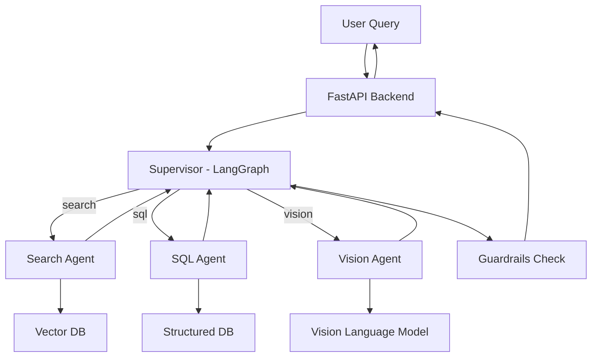

# OmniBrain — AI/RAG Agent Workflow

## Overview
This document describes how a user query flows through the RAG/Agent system, from input to final grounded answer.

## Query Flow (Step-by-Step)

1. User uploads a document and asks a question via the frontend.
2. Backend (FastAPI) receives the query and passes it to the Supervisor.
3. Supervisor classifies the query using `ROUTING_PROMPT`:
   - `search` → Search Agent (semantic search over vector DB)
   - `sql` → SQL Agent (structured/historical data)
   - `vision` → Vision Agent (charts/images via VLM)
4. The selected agent processes the query and returns a structured result.
5. Supervisor synthesizes the result into a final answer using `QA_PROMPT`.
6. Guardrails checks the answer for hallucinations/toxicity.
7. Backend returns the grounded, cited answer to the frontend.

## Diagram

## Notes
- Routing decision uses `ROUTING_PROMPT` (see `prompt_templates.py`)
- Final answer synthesis uses `QA_PROMPT`
- Guardrails is a separate module (Eval/Guardrails owner)
- This workflow will be implemented in code starting Day 13 (Supervisor) per the 20-day plan
